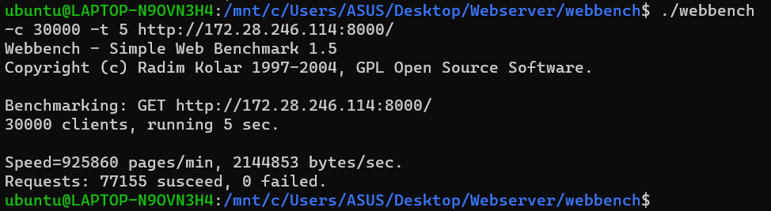

# 简单WebServer实现

## 项目基本信息

### 文件夹结构

```
Webserver
|-- resources           // 请求文件根路径
|-- webbench            // 压力测试工具
|-- http_process.cpp    // 对http请求进行处理并填充响应
|-- http_process.h
|-- Webserver.cpp       // 服务器实现与配置，包含I/O处理单元
|-- Webserver.h
|-- Mysql_connpool.cpp  // 与数据库之间的连接处理方法
|-- Mysql_connpool.h
|-- main.cpp            // 读入端口参数并启动服务器
|-- ThreadPool.h        // 处理请求队列中请求的线程池
|-- site.url            // 使用siege压力测试的url
|-- README.md
```

### 运行方式

#### 运行环境

+ 架构：Intel x86_64 (虚拟机)
+ 操作系统：Ubuntu 20.04
+ 编译器：g++
+ 数据库：mysql 8.0

#### 浏览器测试环境

+ Windows、Linux网络
+ Google Chrome

#### 运行步骤

##### 1. 首先创建数据库

进入mysql数据库后，输入：

```sql
// 建立test数据库
CREATE DATABASE test;

// 创建user表
USE test;
CREATE TABLE user(
    username char(50) NULL,
    passwd char(50) NULL
)ENGINE=InnoDB;
```

创建存储用户账号信息的test数据库和user表

##### 2. 修改连接数据库配置

在`Webserver.cpp`文件的`Webserver(int port)`构造方法中，将语句`connpool->init_mysql_connpool("127.0.0.1", "root", "root", "test", 3306, 8);`中的数据库配置修改成自定义的配置，其中第一个参数为数据库主机，第二个参数为数据库用户名，第三个参数为数据库密码，第四个参数为数据库名称，第五个参数为数据库端口，第六个参数为数据库连接池连接数。

##### 3. 终端运行

进入Webserver文件夹目录，在终端输入：

```
g++ *.cpp -lpthread -lmysqlclient
./a.out
```

服务器默认在8000端口运行，如果想换其它端口，可以使用命令`./a.out port`，即可在端口号为`port`的端口运行服务器。

### 技术要点

+ 根据服务器编程基本框架，将服务器分为I/O处理单元、逻辑单元、存储单元、请求队列四个模块
+ 使用多线程编程，利用线程池实现了请求队列模块
+ 使用epoll进行I/O处理，监听http的请求与响应
+ 使用状态机对http请求进行处理并填充响应，实现逻辑单元
+ 使用mysql数据库对用户信息进行存储，资源文件存储在本地

### 项目实现过程

#### 1. 服务器编程基本框架


+ I/O 处理单元是服务器管理客户连接的模块。它通常要完成以下工作：等待并接受新的客户连接，接收客户数据，将服务器响应数据返回给客户端。但是数据的收发不一定在 I/O 处理单元中执行，也可能在逻辑单元中执行，具体在何处执行取决于事件处理模式。
+ 一个逻辑单元通常是一个进程或线程。它分析并处理客户数据，然后将结果传递给 I/O 处理单元或者直接发送给客户端（具体使用哪种方式取决于事件处理模式）。服务器通常拥有多个逻辑单元，以实现对多个客户任务的并发处理。
+ 网络存储单元可以是数据库、缓存和文件，但不是必须的。
+ 请求队列是各单元之间的通信方式的抽象。I/O 处理单元接收到客户请求时，需要以某种方式通知一个逻辑单元来处理该请求。同样，多个逻辑单元同时访问一个存储单元时，也需要采用某种机制来协调处理竞态条件。请求队列通常被实现为池的一部分。

**事件处理模式：**

+ 服务器程序有两种常用的事件高效处理模式：Reactor模式和Proactor模式，一般，同步I/O模型用于实现Reactor模式，异步I/O模型用于实现Proactor模式
+ 这个项目使用同步I/O的方式模拟实现Proactor模式，原理是主线程执来行数据读写操作，数据读写完成后，主线程向线程池中的工作线程通知读写已完成事件。对于工作线程，它们就直接得到了数据读写的结果，只需对读写的结果进行逻辑处理即可。
+ 工作流程为：
  1. 主线程向epoll中注册socket上的读就绪事件。
  2. 主线程调用epoll_wait等待socket上有数据可读时进行处理。
  3. 当socket上有数据可读时，epoll_wait通知主线程。主线程从socket循环读取数据，直到没有更多数据可读，然后将读取到的数据封装成一个请求对象并插入请求队列。
  4. 睡眠在请求队列上的某个工作线程被唤醒，它获得请求对象并处理客户请求，然后往epoll内核事件表中注册socket上的写就绪事件。
  5. 主线程调用epoll_wait等待socket可写。
  6. 当socket可写时epoll_wait通知主线程。主线程往socket上写入服务器处理客户请求的结果。
+ 工作流程图：
  

#### 2. 请求队列

请求队列部分，在`ThreadPool.h`中实现，具体思路为创建一个处理http请求的线程池类，这个线程池类中包含请求队列，和添加任务到请求队列的方法，线程池类定义为模板类来实现，它的一个实例可以是处理http请求并响应的`http_process`类，模板类的任务入口函数为`void process()`，由线程池中的线程执行。

当主线程读取请求数据之后，它会将数据封装成一个`http_process`类的对象并将其插入请求队列，每次向请求队列中添加任务或从中取出任务都需要加锁保护，线程池类在初始化时会创建一个值为0的信号量，代表请求队列中的任务数，添加任务加一，线程取出任务减一，请求队列中有任务时，线程池中的空闲线程就会从请求队列中取任务来执行，此时信号量减一，若信号量为0，说明没有任务可取，工作线程就被阻塞，等待有新任务再执行。

#### 3. I/O处理单元

I/O处理单元在`Webserver.cpp`中实现，在启动服务器的方法`start_server()`中，创建了一个服务器的套接字，使用epoll和LT触发模式对客户端发送来的请求进行I/O处理。

#### 4. 逻辑单元

逻辑单元在`http_process.h`和`http_process.cpp`中实现，在逻辑单元中，需要使用状态机对http请求进行解析和处理，对于http请求，依次处理请求行、请求头、请求体三部分，然后根据请求内容生成相应的响应数据并写入服务器套接字中，最后响应信息返回到客户浏览器上并被渲染出来。

#### 5. 存储单元

资源文件的根目录在`resources`文件夹下，而在登录界面和注册界面需要用到的用户账号信息，存储在mysql数据库中，与数据库之间的连接处理方法在`Mysql_connpool.cpp`和`Mysql_connpool.h`文件中实现，在创建服务器时，会创建一个和数据库之间的连接池，并从数据库中取出用户的账号信息，将用户名和对应的密码存储在内存的一个map中，当进行登录或注册时，可以从map中查询是否有相应的用户名，有用户名且密码正确则登录成功，跳转到欢迎界面，无用户名则注册成功，跳转到登录界面，并将用户信息写入map和数据库中，其它情况跳转到登录失败或注册失败界面。

### 压力测试

#### 使用工具

压力测试使用webbench和siege两种工具进行。webbench能测试处在相同硬件上，不同服务的性能以及不同硬件上同一个服务的运行状况，最多可以模拟3万个并发连接去测试网站的负载能力，siege可以显示更加丰富的压力测试参数，最多可以模拟255个并发连接。

**webbench：**

服务器运行之后，在终端中进入`Webserver/webbench`目录，输入：

```
./webbench -c 并发数 -t 运行测试时间 测试网站URL
```

即可对服务器进行压力测试。

**siege：**

首先安装siege，输入`sudo apt-get install siege`，服务器运行后，在终端输入：

```
siege -c 并发数 -r 重复次数 -f ./site.url
```

`site.url`放在当前目录下，内容中每一行写上一个要访问的测试网站url，程序执行就会随机访问这些url，对这些url进行压力测试，如：

```
http://172.28.246.114:8000/login.html
http://172.28.246.114:8000/register.html
http://172.28.246.114:8000/picture.html
http://172.28.246.114:8000/video.html
```

### 测试结果

**浏览器展示：**

首先在IP地址为`172.28.246.114`的主机上启动服务器程序，然后在另一主机的浏览器的网址栏中输入要测试的url：


可以看到，登录功能、注册功能都可以正常使用，70KB的图片，40MB的视频也能够正常地显示和播放。

**压力测试：**

进入Webserver文件夹目录下的webbench文件夹，输入：

```
./webbench -c 30000 -t 5 http://172.28.246.114:8000/
```

结果如下：



在30000个并发客户端下，每秒查询率为15431QPS，传输速率为2.14MB/s

在当前目录下创建`site.url`文件，里面放入需要测试的url，如：

```
http://172.28.246.114:8000/login.html
http://172.28.246.114:8000/register.html
http://172.28.246.114:8000/picture.html
http://172.28.246.114:8000/video.html
```

继续在终端输入：

```
siege -c 255 -r 100 -f ./site.url
```

结果如下：


+ 总共完成25500次处理
+ 成功率100%
+ 总共用时14.67s
+ 共数据传输0.83MB
+ 响应时间0.15s
+ 平均每秒完成1738.24次传输
+ 平均每秒传输数据0.06MB
+ 实际最高并发数为252.85
+ 成功处理次数为25500，失败处理次数为0
+ 单次传输所花最长时间为0.29s
+ 单次传输所花最短时间为0.01s
