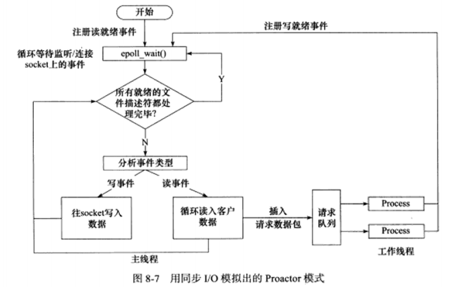

# 简单WebServer实现

## 项目基本信息

### 项目环境

+ 架构：Intel x86_64 (虚拟机)
+ 操作系统：Ubuntu 20.04
+ 汇编器：gas (GNU Assembler) in AT&T mode
+ 编译器：gcc

### 文件夹结构

```
Webserver
|-- resources
    |-- image
    |-- index.html
|-- webbench
    |-- webbench
|-- http_process.cpp
|-- http_process.h
|-- main.cpp
|-- ThreadPool.h
|-- README.md
```

### 运行方式

进入Webserver文件夹目录，在终端输入：

```
g++ *.cpp -pthread
./a.out
```

服务器默认在8000端口运行，如果想换其它端口，则使用命令`./a.out port_number`之后，即可在端口号为`port_number`的端口运行服务器。

### 压力测试方式

压力测试使用webbench这款网站压力测试工具进行。webbench能测试处在相同硬件上，不同服务的性能以及不同硬件上同一个服务的运行状况。webbench的标准测试可以向我们展示服务器的两项内容：每秒钟相应请求数和每秒钟传输数据量。

服务器运行之后，另外开启一个终端，进入`Webserver/webbench`目录，输入：

```
./webbench -c 并发数 -t 运行测试时间 测试网站URL
```

即可对服务器进行压力测试。

### 技术要点

+ 根据服务器编程基本框架，将服务器分为I/O处理单元、逻辑单元、存储单元、请求队列四个模块
+ 使用多线程编程，利用线程池实现了请求队列模块
+ 使用epoll进行I/O处理，监听http的请求与响应
+ 使用状态机对http请求进行处理并填充响应，实现逻辑单元

### 项目实现过程

#### 1. 服务器编程基本框架


+ I/O 处理单元是服务器管理客户连接的模块。它通常要完成以下工作：等待并接受新的客户连接，接收客户数据，将服务器响应数据返回给客户端。但是数据的收发不一定在 I/O 处理单元中执行，也可能在逻辑单元中执行，具体在何处执行取决于事件处理模式。
+ 一个逻辑单元通常是一个进程或线程。它分析并处理客户数据，然后将结果传递给 I/O 处理单元或者直接发送给客户端（具体使用哪种方式取决于事件处理模式）。服务器通常拥有多个逻辑单元，以实现对多个客户任务的并发处理。
+ 网络存储单元可以是数据库、缓存和文件，但不是必须的。
+ 请求队列是各单元之间的通信方式的抽象。I/O 处理单元接收到客户请求时，需要以某种方式通知一个逻辑单元来处理该请求。同样，多个逻辑单元同时访问一个存储单元时，也需要采用某种机制来协调处理竞态条件。请求队列通常被实现为池的一部分。

**事件处理模式：**

+ 服务器程序有两种常用的事件高效处理模式：Reactor模式和Proactor模式，一般，同步I/O模型用于实现Reactor模式，异步I/O模型用于实现Proactor模式
+ 这个项目使用同步I/O的方式模拟实现Proactor模式，原理是主线程执来行数据读写操作，数据读写完成后，主线程向线程池中的工作线程通知读写已完成事件。对于工作线程，它们就直接得到了数据读写的结果，只需对读写的结果进行逻辑处理即可。
+ 工作流程为：
  1. 主线程向epoll中注册socket上的读就绪事件。
  2. 主线程调用epoll_wait等待socket上有数据可读时进行处理。
  3. 当socket上有数据可读时，epoll_wait通知主线程。主线程从socket循环读取数据，直到没有更多数据可读，然后将读取到的数据封装成一个请求对象并插入请求队列。
  4. 睡眠在请求队列上的某个工作线程被唤醒，它获得请求对象并处理客户请求，然后往epoll内核事件表中注册socket上的写就绪事件。
  5. 主线程调用epoll_wait等待socket可写。
  6. 当socket可写时epoll_wait通知主线程。主线程往socket上写入服务器处理客户请求的结果。
+ 工作流程图：
  

#### 2. 实现请求队列



在服务器编程基本框架的四个组成部分中，首先实现请求队列部分，具体思路为创建一个处理http请求的线程池类，这个线程池类中包含请求队列，和添加任务到请求队列的方法，当主线程将读取到的数据封装成一个`http_process`类的对象并将其插入请求队列后，线程池中的睡眠的线程就会从请求队列中取任务来执行，这个部分在`ThreadPool.h`中实现：

```C++
#ifndef _THREADPOOL_H_
#define _THREADPOOL_H_

#include <pthread.h>
#include <semaphore.h>
#include <stdio.h>
#include <string.h>
#include <list>

// 线程池类，将它定义为模板类是为了代码复用，模板参数T是任务类
template<typename T>
class ThreadPool {
public:
    // 线程池中的线程数默认为4，请求队列中的最大请求数默认为50000
    ThreadPool(int threads_num = 4, int requests_max_num = 50000);
    ~ThreadPool();
    bool add_request(T *request);          // 向请求队列添加请求

private:
    static void *request_func(void *arg);  // 每个任务请求执行的函数

private:
    int threads_num;                       // 线程数量
    int requests_max_num;                  // 请求队列中的最大请求数
    pthread_t *threads;                    // 线程池的数组
    std::list<T *> request_queue;          // 请求队列
    bool is_end;                           // 是否结束线程池
    sem_t sem_add_request;                 // 添加请求时用到的信号量
    sem_t sem_request_num;                 // 表示请求队列中请求数的信号量               
};

template <typename T>
ThreadPool<T>::ThreadPool(int threads_num, int requests_max_num) :
        threads_num(threads_num), requests_max_num(requests_max_num),
        threads(NULL), is_end(false) {

    int ret = 0;

    // 线程池中的线程数要大于0
    if (threads_num <= 0) {
        printf("The number of threads should be more than zero!");
        exit(1);
    }

    // 请求队列中的最大请求数要大于0
    if (requests_max_num <= 0) {
        printf("The max number of requests should be more than zero!");
        exit(1);
    }

    // 创建线程数组
    try {
        threads = new pthread_t[threads_num];
    } catch(const std::bad_alloc &e) {
        printf("new pthread_t error!");
        exit(1);
    }

    // 初始化信号量
    ret = sem_init(&sem_add_request, 0, 1);
    if(ret == -1) {
        fprintf(stderr, "sem_add_request sem_init() error: %s\n", strerror(ret));
        exit(1);
    }

    ret = sem_init(&sem_request_num, 0, 0);
    if(ret == -1) {
        fprintf(stderr, "sem_request_num sem_init() error: %s\n", strerror(ret));
        exit(1);
    }

    // 创建线程池中的线程
    for (int i = 0; i < threads_num; ++i) {
        ret = pthread_create(&threads[i], NULL, request_func, this);
        if (ret != 0) {
            fprintf(stderr, "pthread_create error: %s\n", strerror(ret));
            exit(1);
        }

        // 设置为分离线程，自动去回收资源
        ret = pthread_detach(threads[i]);
        if (ret != 0) {
            fprintf(stderr, "pthread_detach error: %s\n", strerror(ret));
            exit(1);
        }
    }
}

template <typename T>
ThreadPool<T>::~ThreadPool() {
    int ret = 0;

    is_end = true;
    delete [] threads;

    // 销毁信号量
    ret = sem_destroy(&sem_add_request);
    if(ret == -1) {
        fprintf(stderr, "sem_add_request sem_destroy() error: %s\n", strerror(ret));
        exit(1);
    }

    ret = sem_destroy(&sem_request_num);
    if(ret == -1) {
        fprintf(stderr, "sem_request_num sem_destroy() error: %s\n", strerror(ret));
        exit(1);
    }
}

template <typename T>
bool ThreadPool<T>::add_request(T *request) {
    // 请求无效时直接返回
    if (!request) {
        return false;
    }

    // 添加请求时需对请求队列进行保护
    sem_wait(&sem_add_request);

    // 当请求队列已满时，添加失败，并且返回
    int req_que_size = request_queue.size();
    if (req_que_size > requests_max_num) {
        sem_post(&sem_add_request);
        return false;
    }
    // 请求队列未满则可添加请求，同时将队列中的请求数加一
    else {
        request_queue.push_back(request);
        sem_post(&sem_request_num);
    }

    sem_post(&sem_add_request);
    return true;
}

template <typename T>
void *ThreadPool<T>::request_func(void *arg) {
    // 向每个线程传入的参数是线程池
    ThreadPool *pool = (ThreadPool *)arg;
    // 如果is_end不为真，线程池中的线程进行请求处理，否则结束线程池
    while (!pool->is_end) {
        // 请求队列中的请求数减一
        sem_wait(&pool->sem_request_num);
        // 保护队列
        sem_wait(&pool->sem_add_request);
        
        // 取队首的请求进行处理
        T *request = pool->request_queue.front();
        pool->request_queue.pop_front();
        // 线程池中的线程执行的处理函数，需要在request的具体类中实现方法
        request->process();
        
        sem_post(&pool->sem_add_request);
    }
    return NULL;
}

#endif
```

线程池类定义为模板类来实现，它的一个实例可以是处理http请求并进行相应的`http_process`类，模板类的任务入口函数为`void process()`，由线程池中的线程执行。

#### 3. 实现I/O处理单元


服务器编程基本框架的I/O处理单元在`main.cpp`中实现，使用epoll和LT触发模式进行I/O处理，代码如下：

```C++
#include <stdio.h>
#include <stdlib.h>
#include <sys/epoll.h>
#include <sys/socket.h>
#include <netinet/in.h>
#include <arpa/inet.h>
#include <errno.h>
#include <fcntl.h>
#include <unistd.h>
#include <iostream>
#include "ThreadPool.h"
#include "http_process.h"

#define MAX_FDS_NUM 50000     // 最大的文件描述符个数
#define MAX_EVENTS_NUM 20000  // 监听的最大的事件数量

const int default_port_number = 8000;  // 默认端口号
const int epoll_size = 5;              // epoll监听的fd个数

// 向epoll里添加监听的文件描述符，并设置为非阻塞
extern void epoll_add_fd(int epoll_fd, int listen_fd, bool is_oneshot);

int main(int argc, char *argv[]) {
    // 记录端口号
    int port_number = default_port_number;
    if (argc > 1) {
        port_number = atoi(argv[1]);
    }
    printf("server port: %d\n", port_number);

    int ret = 0;
    
    // 创建处理http请求的线程池
    ThreadPool<http_process> *threadpool = NULL;
    try {
        threadpool = new ThreadPool<http_process>;
    } catch(const std::bad_alloc &e) {
        printf("new ThreadPool error!\n");
        exit(1);
    }

    // 创建存储http请求的数组
    http_process *requests = NULL;
    try {
        requests = new http_process[MAX_FDS_NUM];
    } catch(const std::bad_alloc &e) {
        printf("new http_process error!\n");
        exit(1);
    }

    // 创建服务器的socket
    int server_socket_fd = socket(AF_INET, SOCK_STREAM, IPPROTO_TCP);
    if(server_socket_fd < 0) { 
        printf("server_socket_fd socket() error!\n"); 
        exit(1); 
    }
    // 对处于TIME_WAIT状态下的socket，设置端口复用
    int opt = 1; 
    ret = setsockopt(server_socket_fd, SOL_SOCKET, SO_REUSEADDR, &opt, sizeof(opt)); 
    if (ret < 0) {
        printf("setsockopt error!\n");
        exit(1);
    }

    // 设置服务端套接字的信息
    struct sockaddr_in server_addr;
    memset(&server_addr, 0, sizeof(server_addr)); 
    // 设置服务器的IP协议为IPv4
    server_addr.sin_family = AF_INET;
    // 设置服务端IP地址
    server_addr.sin_addr.s_addr = inet_addr("0.0.0.0");
    // 设置服务器端口号
    server_addr.sin_port = htons(port_number);

    // 将地址与套接字进行绑定
	ret = bind(server_socket_fd, (struct sockaddr *)&server_addr, sizeof(server_addr));
	if(ret < 0) {
		printf("bind() error!\n");
		close(server_socket_fd);
		exit(1); 
	}
	printf("server bind successful!\n");

	// 服务器端监听，服务器的套接字排队的最大连接个数为epoll监听的fd个数
	ret = listen(server_socket_fd, epoll_size);
    if (ret != 0) {
		printf("Server listen error!\n");
		exit(1);
	}
  	printf("listening...\n\n");

    // 创建epoll事件数组和epoll对象
    epoll_event events[MAX_EVENTS_NUM];
    // 创建一个epoll句柄，记录这个epoll句柄的fd
    int epoll_fd = epoll_create(epoll_size);
    // 每个http请求都会被添加到这个epoll句柄中
    http_process::epoll_fd = epoll_fd;
    // 将服务器的fd添加到epoll对象中
    epoll_add_fd(epoll_fd, server_socket_fd, false);

    while (true) {
        // 获取epoll句柄需要处理的事件数目
        int event_num = epoll_wait(epoll_fd, events, MAX_EVENTS_NUM, -1);
        // 如果调用失败且不是信号中断导致默认阻塞的epoll_wait方法返回-1，那么退出
        if (event_num < 0 && errno != EINTR) {
            printf("epoll_wait error!\n");
            break;
        }

        // 遍历要处理事件
        for (int i = 0; i < event_num; ++i) {
            // 获取epoll中的监听的事件和事件的fd
            int event_fd = events[i].data.fd;
            auto event = events[i].events;
            // 如果服务器套接字监听到有事件，说明客户端有http请求连接
            if (event_fd == server_socket_fd) {
                // 设置连接客户端的套接字的信息
                struct sockaddr_in client_addr;
                memset(&client_addr, 0, sizeof(client_addr));
                socklen_t client_addr_len = sizeof(client_addr);
                // 返回与客户端进行连接通信的套接字的fd
                int request_socket_fd = accept(server_socket_fd, (struct sockaddr *)&client_addr, &client_addr_len);
                if (request_socket_fd < 0) {
                    printf("request_socket_fd accept() error!\n");
                    continue;
                }

                // 如果客户端的连接数已经满了，服务器正在忙
                if (http_process::client_cnt >= MAX_FDS_NUM) {
                    // 关闭与客户端连接的套接字
                    close(request_socket_fd);
                    continue;
                }

                // 初始化连接的客户端的数据
                requests[request_socket_fd].init_process(request_socket_fd, client_addr);
            }
            // 如果客户端发生了异常错误或断开，那么结束http处理过程
            else if (event & (EPOLLRDHUP | EPOLLHUP | EPOLLERR)) {
                requests[event_fd].end_process();
            }
            // 如果发生了读事件
            else if (event & EPOLLIN) {
                // 判断数据能否一次性全部读完
                if (!requests[event_fd].read()) {
                    // 不能则结束http处理过程
                    requests[event_fd].end_process();
                } else {
                    // 能则将请求事件添加到线程池中执行
                    threadpool->add_request(&requests[event_fd]);
                }
            }
            // 如果发生了写事件
            else if (event & EPOLLOUT) {
                // 判断能否一次性写完数据
                if (!requests[event_fd].write()) {
                    // 不能则结束http处理过程
                    requests[event_fd].end_process();
                }
            }
        }
    }

    // 关闭epoll句柄和服务器的套接字
    close(epoll_fd);
    close(server_socket_fd);
    printf("server close!\n");
    
    delete [] requests;
    delete threadpool;
}
```

### 4. 实现逻辑单元


逻辑单元在`http_process.h`和`http_process.cpp`中实现，在逻辑单元中，需要使用状态机对http请求进行解析和处理，并生成相应的响应数据，代码如下：

`**http_process.h**`：
```C++
#ifndef _HTTP_PROCESS_H_
#define _HTTP_PROCESS_H_

#include <arpa/inet.h>
#include <errno.h>
#include <fcntl.h>
#include <netinet/in.h>
#include <pthread.h>
#include <signal.h>
#include <stdarg.h>
#include <stdio.h>
#include <stdlib.h>
#include <string.h>
#include <sys/epoll.h>
#include <sys/mman.h>
#include <sys/socket.h>
#include <sys/stat.h>
#include <sys/types.h>
#include <sys/uio.h>
#include <unistd.h>

class http_process {
public:
    // 默认使用的http版本
    const char* default_protocol_version = "HTTP/1.1";
    // 服务器获取文件的根目录
    const char* root_path = "./resources";

    // HTTP请求方法
    enum HTTP_REQUEST_METHOD {
        GET,      // 请求指定的页面信息，并返回实体主体
        HEAD,     // 类似于GET请求，只不过返回的响应中没有具体的内容，用于获取报头
        POST,     // 向指定资源提交数据进行处理请求
        PUT,      // 从客户端向服务器传送的数据取代指定的文档的内容
        DELETE,   // 请求服务器删除指定的页面
        TRACE,    // 回显服务器收到的请求，主要用于测试或诊断
        OPTIONS,  // 允许客户端查看服务器的性能
        CONNECT,  // HTTP/1.1 协议中预留给能够将连接改为管道方式的代理服务器
        PATCH     // 是对PUT方法的补充，用来对已知资源进行局部更新
    };
    
    // 请求的解析状态 
    enum REQUEST_PARSING_STATE {
        REQUEST_PARSING_STATE_LINE,    // 正在解析请求行
        REQUEST_PARSING_STATE_HEADER,  // 正在解析请求头
        REQUEST_PARSING_STATE_BODY     // 正在解析请求体
    };
    
    // 请求解析的可能结果
    enum REQUEST_PARSING_RESULT {
        REQUEST_COMPLETE,              // 请求已经完整读取
        REQUEST_NOT_COMPLETE,          // 请求读取不完整，继续读取客户端数据
        REQUEST_FILE_SUCCESS,          // 请求文件成功，状态码返回200
        REQUEST_SYNTAX_ERROR,          // 请求存在语法错误，状态码返回400
        REQUEST_FORBIDDEN,             // 请求的客户端访问权限不够，不能访问资源，状态码返回403
        REQUEST_NO_FILE,               // 请求的文件不存在，状态码返回404
        SERVER_INTERNAL_ERROR,         // 服务器内部出错，状态码返回500
        CONNECTION_CLOSED              // 客户端关闭连接
    };
    
    // 读取每一行数据时的状态
    enum READ_LINE_STATUS {
        READ_LINE_COMPLETE,             // 读取到了完整的一行
        READ_LINE_NOT_COMPLETE,         // 读取的行数据还不完整，还需继续
        READ_LINE_BAD                   // 读取出错
    };

public:
    http_process() {}
    ~http_process() {}

    void init_process(int sockfd, const sockaddr_in& addr);  // 初始化对http的处理过程
    void end_process();  // 结束处理
    void process();      // 由线程池中的线程调用，处理http请求
    bool read();         // 以非阻塞方式读数据
    bool write();        // 以非阻塞方式写数据

private:
    void init_process_data();  // 初始化对http进行处理时需要的数据

    // 读取处理分析http请求
    REQUEST_PARSING_RESULT process_read();
    /* 与读取分析http请求有关的函数 */
    READ_LINE_STATUS read_line();                             // 读取每一行数据
    REQUEST_PARSING_RESULT read_request_line(char *text);     // 读取解析请求行
    REQUEST_PARSING_RESULT read_request_headers(char *text);  // 读取解析请求头
    REQUEST_PARSING_RESULT read_request_body(char *text);     // 读取解析请求体
    REQUEST_PARSING_RESULT get_request_file();                // 获取请求文件

    // 填充处理http响应
    bool process_write(REQUEST_PARSING_RESULT read_result);
    /* 与填充处理http响应有关的函数 */
    bool write_response(const char* format, ...);    // 填充响应
    // 填充响应状态行
    bool write_response_status_line(const char *protocol_version, int status, const char* title);
    // 填充响应头
    bool write_response_headers(int content_length);
    // 填充响应体
    bool write_response_body(const char* content);

public:
    static const int FILENAME_MAX_LEN = 8190;   // 请求的文件名的最大长度
    static const int READ_BUFFER_SIZE = 1024;   // 读缓冲区的长度
    static const int WRITE_BUFFER_SIZE = 1024;  // 写缓冲区的长度

    static int epoll_fd;    // 所有socket上的事件由同一个epoll进行监听
    static int client_cnt;  // 所有客户端总共连接的数量

private:
    int socket_fd;            // 这个http连接到的socket
    sockaddr_in socket_addr;  // 连接对方的socket地址
    
    char read_buffer[READ_BUFFER_SIZE];  // 读缓冲区
    int read_index;                      // 读缓冲区中已经读入的数据的结尾的再往下一个位置
    int check_index;                     // 当前正在解析的字符在读缓冲区中的位置
    int line_start_index;                // 当前正在解析的行的内容在读缓存区中的起始位置

    REQUEST_PARSING_STATE request_parsing_state;  // 解析请求不同部分的状态机所处的状态
    HTTP_REQUEST_METHOD request_method;           // http请求方法
    char *request_url;                            // 请求地址
    char *request_version;                        // http协议版本，这里只支持HTTP/1.1

    char request_file_path[FILENAME_MAX_LEN];  // 客户端请求的文件的路径
    char *request_host;     // 主机名
    bool is_keep_alive;     // 请求是否需要保持连接
    int cache_max_age;      // 缓存最长时间
    char *user_agent;       // 用户代理
    char *accept;           // 浏览器可以接收的内容类型
    char *referer;          // 当前请求URL是在什么地址中引用的
    char *accept_encoding;  // 浏览器可以处理的编码方式
    char *accept_language;  // 浏览器接收的语言
    int content_length;     // 请求消息长度

    char write_buffer[WRITE_BUFFER_SIZE];  // 写缓冲区
    int write_index;                       // 写缓冲区中待发送的字节数
    char* request_file_address;            // 请求的文件被映射到内存中的起始位置
    struct stat request_file_stat;         // 请求的文件状态
    
    struct iovec write_iov[2];             // 向量I/O缓冲区，第一个缓冲区存放响应信息，第二个缓冲区存放可能会获取的请求文件的内存起始地址
    int write_iovcnt;                      // 要写的向量I/O缓冲区数目
    size_t response_bytes_to_send;         // 将要发送的响应内容的字节数
    size_t response_bytes_have_send;       // 已发送的响应内容的字节数
};

#endif
```

`**http_process.cpp**`：

```C++
#include "http_process.h"

// http状态码
enum HTTP_STATUS_CODE {
    SUCCESS_200,       // 2开头的状态码代表操作被成功接收并处理，200代表请求成功
    CLIENT_ERROR_400,  // 4开头的状态码代表客户端错误，400代表请求的语法错误，服务器无法理解
    CLIENT_ERROR_403,  // 403代表请求被服务器拒绝了
    CLIENT_ERROR_404,  // 404代表未找到资源
    SERVER_ERROR_500   // 5开头的状态码代表服务器错误，500代表服务器内部错误，无法完成请求
};

// 状态结构体
struct {
    HTTP_STATUS_CODE code;    // 状态码
    const char *message;      // 状态消息
    const char *description;  // 状态含义描述
} status[5] = {
    {
        SUCCESS_200,
        "OK",
        "The server successfully processed the request!"
    },
    {
        CLIENT_ERROR_400,
        "Bad Request",
        "The request's syntax is incorrect and the server cannot understand it!"
    },
    {
        CLIENT_ERROR_403,
        "Forbidden",
        "The request was rejected by the server!"
    },
    {
        CLIENT_ERROR_404,
        "Not Found",
        "Resource not found!"
    },
    {
        SERVER_ERROR_500,
        "Internal Server Error!",
        "Server internal error, unable to complete the request!"
    }
};

// 所有的客户端数
int http_process::client_cnt = 0;
// 所有socket上的事件由同一个epoll进行监听
int http_process::epoll_fd = -1;

// 向epoll里添加监听的文件描述符，并设置为非阻塞，注册读就绪事件
extern void epoll_add_fd(int epoll_fd, int listen_fd, bool is_oneshot) {
    // 将文件描述符设置为非阻塞
    int flags = fcntl(listen_fd, F_GETFL);
    if (fcntl(listen_fd, F_SETFL, flags | O_NONBLOCK) < 0) {
        printf("fcntl set nonblock error!\n");
        exit(1);
    }

    epoll_event event;
    event.events = EPOLLIN | EPOLLRDHUP;
    if (is_oneshot) {
        event.events |= EPOLLONESHOT;
    }
    event.data.fd = listen_fd;
    epoll_ctl(epoll_fd, EPOLL_CTL_ADD, listen_fd, &event);
}

// 从epoll中删除监听的文件描述符
void epoll_delete_fd(int epoll_fd, int listen_fd) {
    epoll_ctl(epoll_fd, EPOLL_CTL_DEL, listen_fd, NULL);
    close(listen_fd);
}

// 修改epoll里的文件描述符
void epoll_modify_fd(int epoll_fd, int listen_fd, int events) {
    epoll_event event;
    // 重置EPOLLONESHOT以确保下一次可读时能够被触发
    event.events = events | EPOLLET | EPOLLONESHOT | EPOLLRDHUP;
    event.data.fd = listen_fd;
    epoll_ctl(epoll_fd, EPOLL_CTL_MOD, listen_fd, &event);
}

// 初始化处理http的基本数据
void http_process::init_process_data() {
    read_index = 0;
    check_index = 0;
    line_start_index = 0;

    // 默认状态为解析请求行
    request_parsing_state = REQUEST_PARSING_STATE_LINE;
    // 默认的http请求方式为GET
    request_method = GET;
    request_url = NULL;              
    request_version = NULL;

    request_host = NULL;
    // 默认不保持连接
    is_keep_alive = false;
    cache_max_age = 0;
    user_agent = NULL;
    accept = NULL;
    referer = NULL;
    accept_encoding = NULL;
    accept_language = NULL;
    content_length = 0;

    write_index = 0;

    response_bytes_to_send = 0;
    response_bytes_have_send = 0;

    memset(&read_buffer, 0, sizeof(read_buffer));
    memset(&write_buffer, 0, sizeof(write_buffer));
    memset(&request_file_path, 0, sizeof(request_file_path));
}

// 初始化连接,外部调用初始化套接字地址
void http_process::init_process(int sockfd, const sockaddr_in& addr){
    this->socket_fd = sockfd;
    this->socket_addr = addr;
    
    int ret = 0;

    // 对处于TIME_WAIT状态下的socket，设置端口复用
    int opt = 1; 
    ret = setsockopt(socket_fd, SOL_SOCKET, SO_REUSEADDR, &opt, sizeof(opt)); 
    if (ret < 0) {
        printf("http_process init_process setsockopt error!\n");
        exit(1);
    }
    epoll_add_fd(epoll_fd, sockfd, true);
    // 客户端数量加一
    client_cnt++;
    // 初始化处理http的基本数据
    init_process_data();
}

// 结束处理
void http_process::end_process() {
    if (socket_fd == -1) {
        return;
    }
    // 从epoll中删除监听的文件描述符
    epoll_delete_fd(epoll_fd, socket_fd);
    socket_fd = -1;
    // 客户端连接数量减一
    client_cnt--;
}

// 循环读取客户端数据
bool http_process::read() {
    // 如果读入的数据超过了读缓冲区的大小，那么返回失败
    if (read_index >= READ_BUFFER_SIZE) {
        return false;
    }

    // 读取字节大小
    int read_bytes = 0;
    while (true) {
        // 从read_buffer的read_index处开始读入数据到缓冲区中，返回读取字节大小
        read_bytes = recv(socket_fd, &read_buffer[read_index], READ_BUFFER_SIZE - read_bytes, 0);
        if (read_bytes == -1) {
            // 非阻塞读时没有数据，说明读完，退出循环
            if(errno == EAGAIN || errno == EWOULDBLOCK) {
                break;
            }
            // 其它错误则直接返回错误
            return false;
        }
        // 对方关闭连接，直接返回错误
        else if (read_bytes == 0) {
            return false;
        }
        // 加上这一次读取的数据大小以更新下一次读取的起始位置
        read_index += read_bytes;
    }

    return true;
}

// 读入解析http请求
http_process::REQUEST_PARSING_RESULT http_process::process_read() {
    REQUEST_PARSING_RESULT ret;
    READ_LINE_STATUS line_status = READ_LINE_COMPLETE;

    char* line_content = NULL;
    // 当在读入请求体状态下且之前读取到了一行完整的数据，或者在其它状态下读入到了一行完整的数据
    while ((request_parsing_state == REQUEST_PARSING_STATE_BODY && line_status == READ_LINE_COMPLETE)
                || (line_status = read_line()) == READ_LINE_COMPLETE) {
        // 获取一行数据的内容
        line_content = &read_buffer[line_start_index];
        // 设置读取下一行数据的起始位置为检查的位置
        line_start_index = check_index;
        // printf("%s\n", line_content);

        // 判断主状态机状态
        switch (request_parsing_state) {
            // 当主状态机在读入请求行时
            case REQUEST_PARSING_STATE_LINE: {
                // 读入获取到的那行数据
                ret = read_request_line(line_content);
                // 如果请求语法错误，那么直接结束返回
                if (ret == REQUEST_SYNTAX_ERROR) {
                    return REQUEST_SYNTAX_ERROR;
                }
                // 否则继续循环
                break;
            }
            // 当主状态机在读入请求头时
            case REQUEST_PARSING_STATE_HEADER: {
                ret = read_request_headers(line_content);
                // 如果请求语法错误，那么直接返回
                if (ret == REQUEST_SYNTAX_ERROR) {
                    return REQUEST_SYNTAX_ERROR;
                // 如果获取到了完整的请求，那么读入具体信息并返回
                } else if (ret == REQUEST_COMPLETE) {
                    return get_request_file();
                }
                // 否则继续循环
                break;
            }
            // 当主状态机在读入请求体时
            case REQUEST_PARSING_STATE_BODY: {
                ret = read_request_body(line_content);
                // 如果获取到了完整的请求，那么读入具体信息并返回
                if (ret == REQUEST_COMPLETE) {
                    return get_request_file();
                }
                // 否则设置从状态机的状态为行数据不完整
                line_status = READ_LINE_NOT_COMPLETE;
                break;
            }
            // 否则返回内部错误
            default: {
                return SERVER_INTERNAL_ERROR;
            }
        }
    }
    // 主状态机返回请求不完整，继续读取数据
    return REQUEST_NOT_COMPLETE;
}

// 读入一行数据，按照格式，一行数据的结尾应该是\r\n
http_process::READ_LINE_STATUS http_process::read_line() {
    // 遍历已经在读缓存区中但还未分析的字符
    for ( ; check_index < read_index; ++check_index) {
        char check_char = read_buffer[check_index];
        // 如果当前分析的字符为'\r'
        if (check_char == '\r') {
            // 如果当前分析的字符是最后一个字符，但还未读到'\n'结束一行
            if (check_index + 1 == read_index) {
                // 那么返回行数据不完整
                return READ_LINE_NOT_COMPLETE;
            }
            // 如果当前分析的后一个字符是'\n'，说明读完一行，将\r\n所在位置置为\0
            else if (read_buffer[check_index + 1] == '\n') {
                read_buffer[check_index++] = '\0';
                read_buffer[check_index++] = '\0';
                // 返回读取到完整的一行
                return READ_LINE_COMPLETE;
            }
            // 否则说明'\r'后面没有跟字符或者跟的字符不是'\n'，返回读取出错
            else {
                return READ_LINE_BAD;
            }
        }
        // 如果当前分析的字符为'\n'
        else if (check_char == '\n')  {
            // 如果'\n'不是一行的前两个字符且前一个字符是'\r'，说明读完一行
            if (check_index > 1 && read_buffer[check_index - 1] == '\r') {
                // 将\r\n所在位置置为\0，返回读取到完整的一行
                read_buffer[check_index - 1] = '\0';
                read_buffer[check_index++] = '\0';
                return READ_LINE_COMPLETE;
            }
            // 否则说明'\n'前面没有字符或者字符不是'\r'，返回读取出错
            else {
                return READ_LINE_BAD;
            }
        }
    }
    // 返回行数据不完整
    return READ_LINE_NOT_COMPLETE;
}

// 读入http请求行，记录请求方法，请求资源的url,和http的版本号
http_process::REQUEST_PARSING_RESULT http_process::read_request_line(char* text) {
    // 获取请求方法的字符串
    char *request_method_str = strtok(text, " ");
    if (!request_method_str) {
        return REQUEST_SYNTAX_ERROR;
    }

    // 将请求方法的字符串转换为枚举类型并存储，忽略大小写
    if (strcasecmp(request_method_str, "GET") == 0) {
        request_method = GET;
    }
    // 如果没有相应的请求方法，返回请求语法错误
    else {
        return REQUEST_SYNTAX_ERROR;
    }

    // 获取请求的url
    request_url = strtok(NULL, " ");
    if (!request_url) {
        return REQUEST_SYNTAX_ERROR;
    }
    // 去掉http://，和主机名再保存
    if (strncasecmp(request_url, "http://", 7) == 0) {   
        request_url += 7;
        request_url = strchr(request_url, '/');
    }

    if (!request_url || request_url[0] != '/') {
        return REQUEST_SYNTAX_ERROR;
    }

    // 获取请求的版本，这里只支持http/1.1版本
    request_version = strtok(NULL, "\n");
    if (!request_version) {
        return REQUEST_SYNTAX_ERROR;
    }
    if (strcasecmp(request_version, "HTTP/1.1") != 0) {
        return REQUEST_SYNTAX_ERROR;
    }

    // 状态机检查状态变为正在分析请求头
    request_parsing_state = REQUEST_PARSING_STATE_HEADER;
    // 继续读取客户端数据
    return REQUEST_NOT_COMPLETE;
}

// 读入http请求头每一行的头部信息
http_process::REQUEST_PARSING_RESULT http_process::read_request_headers(char* text) {
    // 如果头部字段是请求资源所在的主机和端口
    if (strncasecmp(text, "Host:", 5) == 0) {
        // 跳过字段和空格，存储主机和端口信息
        text += 5;
        text += strspn(text, " ");
        request_host = text;
    }
    // 如果头部字段是请求连接管理
    else if (strncasecmp(text, "Connection:", 11) == 0) {
        // 跳过字段和空格，设置是否保持连接状态
        text += 11;
        text += strspn(text, " ");
        if (strcasecmp(text, "keep-alive") == 0) {
            is_keep_alive = true;
        }
    }
    // 如果头部字段是缓存最长时间
    else if (strncasecmp(text, "Cache-Control: max-age=", 23) == 0) {
        // 跳过字段和空格，记录缓存最长时间
        text += 23;
        text += strspn(text, " ");
        cache_max_age = atoi(text);
    }
    // 如果头部字段是用户代理
    else if (strncasecmp(text, "User-Agent:", 11) == 0) {
        // 跳过字段和空格，记录用户代理
        text += 11;
        text += strspn(text, " ");
        user_agent = text;
    }
    // 如果头部字段是浏览器可以接收的内容类型
    else if (strncasecmp(text, "Accept:", 7) == 0) {
        // 跳过字段和空格，记录浏览器可以接收的内容类型
        text += 7;
        text += strspn(text, " ");
        accept = text;
    }
    // 如果头部字段是当前请求URL是在什么地址中引用的
    else if (strncasecmp(text, "Referer:", 8) == 0) {
        // 跳过字段和空格，记录当前请求URL是在什么地址中引用的
        text += 8;
        text += strspn(text, " ");
        referer = text;
    }
    // 如果头部字段是浏览器可以处理的编码方式
    else if (strncasecmp(text, "Accept-Encoding:", 16) == 0) {
        // 跳过字段和空格，记录浏览器可以处理的编码方式
        text += 16;
        text += strspn(text, " ");
        accept_encoding = text;
    }
    // 如果头部字段是浏览器接收的语言
    else if (strncasecmp(text, "Accept-Language:", 16) == 0) {
        // 跳过字段和空格，记录浏览器接收的语言
        text += 16;
        text += strspn(text, " ");
        accept_language = text;
    }
    // 如果头部字段是请求消息长度
    else if (strncasecmp(text, "Content-Length:", 15) == 0) {
        // 跳过字段和空格，记录请求消息长度
        text += 15;
        text += strspn(text, " ");
        content_length = atoi(text);
    }
    // 如果是空行那么请求头已完成读入
    else if(text[0] == '\0') {
        // 如果请求体的消息长度大于0，那么还需要读入请求体
        if (content_length != 0) {
            // 状态机检查状态变为正在分析请求体
            request_parsing_state = REQUEST_PARSING_STATE_BODY;
            // 继续读取客户端数据
            return REQUEST_NOT_COMPLETE;
        }
        // 否则请求读取已经完整
        return REQUEST_COMPLETE;
    }
    // 如果头部字段为其它那么打印无法识别
    else {
        printf("This header can't be recognized: %s\n", text);
    }
    // 继续读取客户端数据
    return REQUEST_NOT_COMPLETE;
}

// 读入http请求的请求体，这里只判断请求体是否被完整读入
http_process::REQUEST_PARSING_RESULT http_process::read_request_body(char* text) {
    if (read_index >= check_index + content_length) {
        text[content_length] = '\0';
        // 请求体被完整读入则返回读取完整
        return REQUEST_COMPLETE;
    }
    // 否则返回请求不完整
    return REQUEST_NOT_COMPLETE;
}

// 获取请求文件，将文件映射进内存request_file_address位置
http_process::REQUEST_PARSING_RESULT http_process::get_request_file() {
    // 将请求文件的url和根文件路径拼接，形成完整的的请求文件路径
    strcpy(request_file_path, root_path);
    int root_path_len = strlen(root_path);
    strncpy(request_file_path + root_path_len, request_url, FILENAME_MAX_LEN - root_path_len - 1);
    // 如果请求文件不存在，返回相应的状态
    if (stat(request_file_path, &request_file_stat) < 0) {
        return REQUEST_NO_FILE;
    }

    // 如果没有对请求文件的访问权限，返回请求受限
    if (!(request_file_stat.st_mode & S_IROTH)) {
        return REQUEST_FORBIDDEN;
    }

    // 如果访问的路径不是文件而是目录，返回请求语法错误
    if (S_ISDIR(request_file_stat.st_mode)) {
        return REQUEST_SYNTAX_ERROR;
    }

    // 只读打开文件
    int fd = open(request_file_path, O_RDONLY);
    // 将文件以私有映射的形式映射进内存，内存区域的写入不会影响到原文件，页内容可以被读取
    request_file_address = (char*)mmap(0, request_file_stat.st_size, PROT_READ, MAP_PRIVATE, fd, 0);
    close(fd);
    // 返回请求文件成功
    return REQUEST_FILE_SUCCESS;
}

// 填充http响应
bool http_process::write() {
    int ret;
    // 如果将要发送的字节为0，那么响应结束
    if (response_bytes_to_send == 0) {
        // 设置监听读事件
        epoll_modify_fd(epoll_fd, socket_fd, EPOLLIN); 
        // 初始化处理http的基本数据
        init_process_data();
        // 返回写入成功
        return true;
    }

    // 循环写数据
    while(true) {
        // 将write_iov中write_iovcnt个缓冲区中的内容写入socket_fd代表的套接字中
        int write_bytes = writev(socket_fd, write_iov, write_iovcnt);
        // 如果写入失败
        if (write_bytes == -1) {
            // 如果错误代码不是EAGAIN，说明不是TCP写缓冲暂时没有空间导致的错误
            if(errno != EAGAIN) {
                // 如果请求文件成功，并在内存中有映射
                if(request_file_address) {
                    // 取消请求文件在内存中的映射并将请求文件的内存地址置为0
                    ret = munmap(request_file_address, request_file_stat.st_size);
                    if (ret < 0) {
                        printf("munmap error!\n");
                        exit(1);
                    }
                    request_file_address = 0;
                }
                // 返回写入数据失败
                return false;
            }
            // 否则继续等待下一次EPOLLOUT事件写入数据
            else {
                epoll_modify_fd(epoll_fd, socket_fd, EPOLLOUT);
                // 返回写入数据成功
                return true;
            }
        }

        // 更新已经写入和准备写入的消息大小
        response_bytes_have_send += write_bytes;
        response_bytes_to_send -= write_bytes;

        // 如果已经发送的字节大小大于等于第一个缓冲区中有关响应信息的内容大小
        if (response_bytes_have_send >= write_iov[0].iov_len) {
            // 说明第一个缓冲区中的内容已经发出，设置第一个缓冲区中内容的长度为0，表示发送完毕
            write_iov[0].iov_len = 0;
            // 更新第二个缓冲区的起始位置和内容大小
            write_iov[1].iov_base = request_file_address + response_bytes_have_send - write_index;
            write_iov[1].iov_len = response_bytes_to_send;
        }
        // 否则说明第一个缓冲区中的内容还没发送完
        else {
            // 更新第一个缓冲区中起始位置和内容长度
            write_iov[0].iov_base = write_buffer + response_bytes_have_send;
            write_iov[0].iov_len = write_iov[0].iov_len - write_bytes;
        }

        // 如果没有将要发送的数据，说明缓冲区中的内容已经全部发送完
        if (response_bytes_to_send <= 0) {
            // 如果请求文件成功，并在内存中有映射
            if(request_file_address) {
                // 取消请求文件在内存中的映射并将请求文件的内存地址置为0
                ret = munmap(request_file_address, request_file_stat.st_size);
                if (ret < 0) {
                    printf("munmap error!\n");
                    exit(1);
                }
                request_file_address = 0;
            }

            // 设置监听读事件
            epoll_modify_fd(epoll_fd, socket_fd, EPOLLIN);
            // 如果连接状态为保持连接
            if (is_keep_alive) {
                // 那么初始化处理http的基本数据
                init_process_data();
                // 返回写入数据成功
                return true;
            }
            // 否则写入数据失败
            else {
                return false;
            }
        }
    }
}

// 根据处理http请求的结果，填充返回给客户端响应的内容
bool http_process::process_write(REQUEST_PARSING_RESULT read_result) {
    switch (read_result) {
        // 如果读取http请求的处理结果为获取文件成功
        case REQUEST_FILE_SUCCESS:
            // 填充响应行的版本、状态码和状态码消息，状态码为200，表示请求成功
            write_response_status_line(default_protocol_version, 200, status[SUCCESS_200].message);
            // 填充响应头，消息长度为请求文件的大小
            write_response_headers(request_file_stat.st_size);
            // 将写缓冲区中的响应内容放进第一个向量I/O缓冲区中
            write_iov[0].iov_base = write_buffer;
            write_iov[0].iov_len = write_index;
            // 将请求文件的内存地址放进第二个向量I/O缓冲区中
            write_iov[1].iov_base = request_file_address;
            write_iov[1].iov_len = request_file_stat.st_size;
            // 设置需要写的缓冲区数目为2
            write_iovcnt = 2;

            // 准备发送的字节数为两个缓冲区中的内容总数
            response_bytes_to_send = write_index + request_file_stat.st_size;

            return true;
        // 如果请求http语法错误
        case REQUEST_SYNTAX_ERROR:
            // 填充响应行的版本、状态码和状态码消息，状态码为400，表示请求成功
            write_response_status_line(default_protocol_version, 400, status[CLIENT_ERROR_400].message);
            // 填充响应头，消息长度为400状态码消息的长度
            write_response_headers(strlen(status[CLIENT_ERROR_400].description));
            // 如果使用400状态码的消息填充响应体失败，直接返回
            if (!write_response_body(status[CLIENT_ERROR_400].description)) {
                return false;
            }
            break;
        // 如果没有访问权限
        case REQUEST_FORBIDDEN:
            // 填充响应行的版本、状态码和状态码消息，状态码为403，表示请求成功
            write_response_status_line(default_protocol_version, 403, status[CLIENT_ERROR_403].message);
            // 填充响应头，消息长度为403状态码消息的长度
            write_response_headers(strlen(status[CLIENT_ERROR_403].description));
            // 如果使用403状态码的消息填充响应体失败，直接返回
            if (!write_response_body(status[CLIENT_ERROR_403].description)) {
                return false;
            }
            break;
        // 如果服务器没有资源
        case REQUEST_NO_FILE:
            // 填充响应行的版本、状态码和状态码消息，状态码为404，表示请求成功
            write_response_status_line(default_protocol_version, 404, status[CLIENT_ERROR_404].message);
            // 填充响应头，消息长度为404状态码消息的长度
            write_response_headers(strlen(status[CLIENT_ERROR_404].description));
            // 如果使用404状态码的消息填充响应体失败，直接返回
            if (!write_response_body(status[CLIENT_ERROR_404].description)) {
                return false;
            }
            break;
        // 如果服务器内部错误
        case SERVER_INTERNAL_ERROR:
            // 填充响应行的版本、状态码和状态码消息，状态码为500，表示请求成功
            write_response_status_line(default_protocol_version, 500, status[SERVER_ERROR_500].message);
            // 填充响应头，消息长度为500状态码消息的长度
            write_response_headers(strlen(status[SERVER_ERROR_500].description));
            // 如果使用500状态码的消息填充响应体失败，直接返回
            if (!write_response_body(status[SERVER_ERROR_500].description)) {
                return false;
            }
            break;
        default:
            return false;
    }

    // 状态码400、403、404、500的消息填充成功后，将写缓冲区中的响应内容放进第一个向量I/O缓冲区中
    write_iov[0].iov_base = write_buffer;
    write_iov[0].iov_len = write_index;
    // 设置需要写的缓冲区数目为1
    write_iovcnt = 1;
    // 准备发送的字节数为第一个缓冲区中的内容总数
    response_bytes_to_send = write_index;
    return true;
}

// 向写缓冲区中写入响应信息等待发送
bool http_process::write_response(const char* format, ...) {
    // 如果写入的数据超过了写缓冲区的大小，那么返回失败
    if (write_index >= WRITE_BUFFER_SIZE) {
        return false;
    }
    va_list ap;
    va_start(ap, format);
    // 返回按格式写入写缓冲区的内容长度
    int write_len = vsnprintf(write_buffer + write_index, WRITE_BUFFER_SIZE - write_index - 1, format, ap);
    // 如果写入长度大于写缓冲区的剩余大小，返回失败
    if(write_len >= WRITE_BUFFER_SIZE - write_index - 1) {
        return false;
    }
    // 否则更新下一次写入的起始位置
    write_index += write_len;
    va_end(ap);
    return true;
}

// 填充响应状态行
bool http_process::write_response_status_line(const char *protocol_version, int status_code, const char* title) {
    return write_response("%s %d %s\r\n", protocol_version, status_code, title);
}

// 填充响应头
bool http_process::write_response_headers(int response_content_len) {
    // 向响应中填充内容长度、类型、连接状态和空行
    return write_response("Content-Length: %d\r\n", response_content_len) &&
           write_response("Content-Type:%s\r\n", "text/html") &&
           write_response("Connection: %s\r\n", is_keep_alive ? "keep-alive" : "close") &&
           write_response("%s", "\r\n");
}

// 填充响应体，这里直接将消息内容写入
bool http_process::write_response_body(const char *content) {
    return write_response("%s", content);
}

// 线程池中的线程调用的处理函数，对http请求进行处理
void http_process::process() {
    // 对http请求进行读取和处理
    REQUEST_PARSING_RESULT read_result = process_read();
    // 如果读取的结果为请求不完整，需要继续读取数据
    if (read_result == REQUEST_NOT_COMPLETE) {
        // 设置监听读事件，并直接返回
        epoll_modify_fd(epoll_fd, socket_fd, EPOLLIN);
        return;
    }
    
    // 否则对http请求生成相应的响应
    if (!process_write(read_result)) {
        // 如果处理生成响应失败，结束处理过程
        end_process();
    }
    // 设置监听写事件
    epoll_modify_fd(epoll_fd, socket_fd, EPOLLOUT);
}
```

请求文件的根目录在`resources`文件夹下，可以简单地代表存储单元。

### 测试方法

测试在虚拟机上进行，将Webserver文件夹放到虚拟机上，首先在终端里输入`ifconfig`查看虚拟机的IP地址，这里虚拟机的IP地址为`192.168.17.128`：


然后在终端中进入Webserver文件夹，输入：

```
g++ *.cpp -pthread
./a.out
```

此时服务端在虚拟机上运行起来：


然后回到主机，打开浏览器，在网址栏输入虚拟机的IP地址（192.168.17.128）以及指定（8000）端口，并加上要请求的文件`index.html`，这里输入如下：

```
http://192.168.17.128:8000/index.html
```

尝试从主机访问在虚拟机上的服务器：


可以看到，请求的html文件以及其中的图片文件都被加载了出来，实现成功。

在服务器启动的情况下，在虚拟机中另外开启一个终端，进入Webserver文件夹目录下的webbench文件夹，输入：

```
./webbench -c 3000 -t 5 http://192.168.17.128:8000/index.html
```

其中`3000`代表并发数，`5`代表运行测试时间，即可进行压力测试，结果如下：


压力测试成功。
